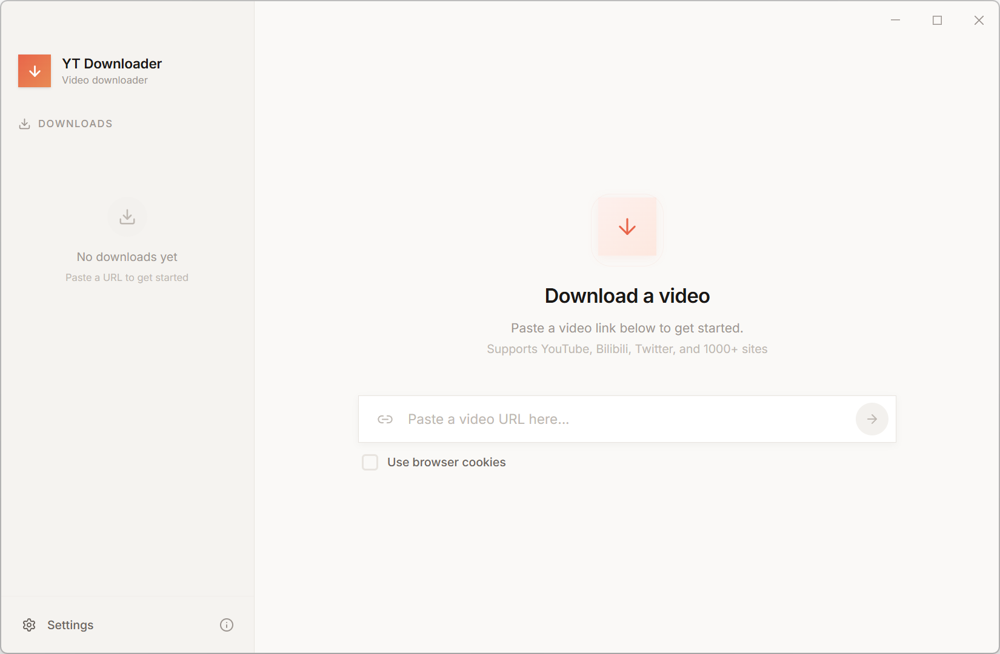

<div align="right">
  <a href="README.md">English</a>
</div>

# YT Downloader

> 简洁美观的桌面视频下载工具，支持 YouTube 及 1000+ 个网站。

[](https://github.com/awly333/yt-downloader/releases)
[](LICENSE)
[](https://www.electronjs.org)

---

## 简介

YT Downloader 是一款原生桌面应用，支持从 YouTube 及 1000+ 个网站下载视频和音频。粘贴链接，选择格式和画质，即可开始下载——全程无需命令行。

内置 [yt-dlp](https://github.com/yt-dlp/yt-dlp) 和 [FFmpeg](https://ffmpeg.org)，**无需额外安装任何依赖。**

基于 Electron、React 和 Tailwind CSS 构建。

---

## 截图



---

## 功能特性

- **全站支持** — 通过 yt-dlp 支持 YouTube 及 1000+ 个网站
- **格式自由选择** — 支持 MP4、MKV、WebM、MP3、M4A、FLAC、WAV、Opus
- **完整格式浏览器** — 可精确选择分辨率、编码、帧率、码率及预估文件大小
- **字幕下载** — 支持多语言、多格式字幕（SRT、VTT、ASS）
- **浏览器 Cookie 透传** — 通过 Chrome、Edge、Firefox、Brave 或本地 Cookie 文件访问受限或私有内容
- **实时下载进度** — 显示每个任务的实时速度、剩余时间和完成百分比
- **取消与重试** — 完整掌控进行中的下载任务
- **播放列表支持** — 自动识别播放列表链接，可勾选单个视频并批量加入下载队列
- **下载限速** — 可为每个任务设置最大下载速度，避免占满带宽
- **多语言界面** — 支持 English、中文、日本語、한국어、Español、Français、Deutsch
- **拖拽操作** — 直接将链接拖入窗口即可开始下载
- **自定义保存路径** — 文件可保存至任意位置
- **自动更新** — 有新版本发布时自动提醒
- **开箱即用** — yt-dlp 和 FFmpeg 均已内置，安装即可使用

---

## 使用本地 Cookie 文件

部分视频需要登录后才能下载（例如年龄限制内容、会员专属视频等）。YT Downloader 支持两种传入 Cookie 的方式：

- **浏览器模式** — 直接从已安装的浏览器（Chrome、Edge、Firefox、Brave）读取 Cookie。操作简单，但在某些系统上需要先关闭浏览器。
- **本地模式** — 手动导出 Cookie 文件并放入指定文件夹。更加稳定，即使没有安装浏览器也可使用。

### 如何导出 Cookie 文件

1. 在 Chrome 或 Edge 中安装 **[Get cookies.txt LOCALLY](https://chromewebstore.google.com/detail/get-cookiestxt-locally/cclelndahbckbenkjhflpdbgdldlbecc)** 扩展。
2. 登录 YouTube（或你想下载的目标网站）。
3. 打开目标网站，点击扩展图标，然后点击 **Export**，即可下载一个 Netscape 格式的 `.txt` Cookie 文件。

### Cookie 文件放在哪里

1. 在 YT Downloader 中，进入 **设置 → Cookie 浏览器 → Local**，下方会显示一个文件夹路径，点击即可直接打开该文件夹。
2. 将导出的 `.txt` 文件复制进去。
3. 完成。应用会自动使用该文件夹中**最近修改的** `.txt` 文件，因此你可以同时放多个文件，最新的那个始终优先生效。

### 如何使用

回到主界面，勾选 **Use browser cookies**，在下拉菜单中选择 **Local**，下方会显示 Cookie 文件夹路径，随时点击可打开并管理你的 Cookie 文件。

> **提示：** Cookie 文件会随浏览器会话过期而失效。如果下载再次失败，重新导出 Cookie 文件替换旧文件即可。

---

## 安装

从 [Releases 页面](https://github.com/awly333/yt-downloader/releases) 下载最新安装包。

| 平台 | 安装包 |
|------|--------|
| Windows | `YT-Downloader-Setup-x.x.x.exe` |
| macOS（Intel） | `YT-Downloader-x.x.x-mac-x64.dmg` |
| macOS（Apple Silicon） | `YT-Downloader-x.x.x-mac-arm64.dmg` |
| Linux | `YT-Downloader-x.x.x-linux-x64.AppImage` |

无需安装任何其他软件，yt-dlp 和 FFmpeg 已随应用一并打包。

---

## 从源码构建

```bash
# 安装依赖
npm install

# 下载内置二进制文件（yt-dlp + ffmpeg）
npm run download-binaries

# 启动开发模式
npm run dev

# 构建生产版本
npm run electron:build

# 重新生成应用图标
npm run icons
```

### 技术栈

| 层级 | 技术 |
|------|------|
| 外壳 | Electron 41 |
| UI | React 19、TypeScript |
| 样式 | Tailwind CSS 4、Framer Motion |
| 状态管理 | Zustand |
| 打包工具 | Vite + esbuild |
| 下载核心 | yt-dlp + FFmpeg（内置） |

---

## 开源许可

[MIT](LICENSE)
